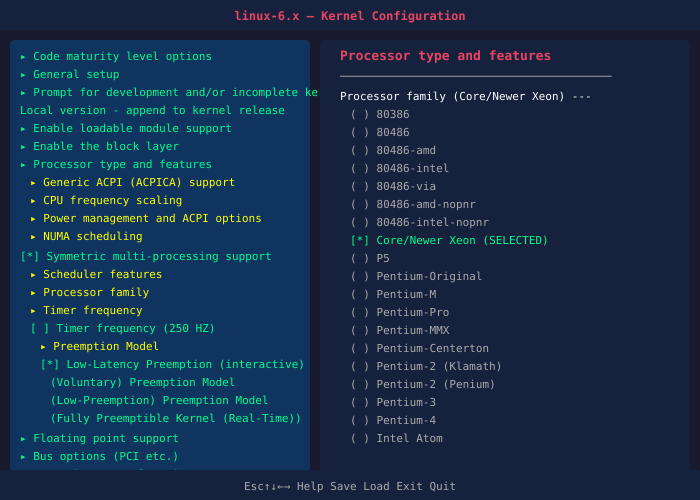
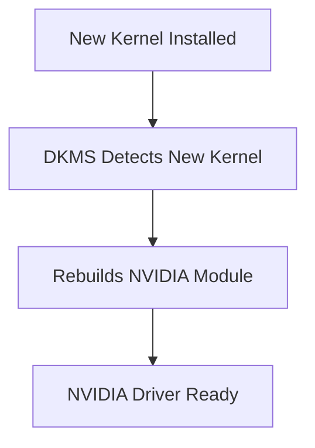
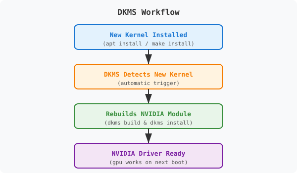

# The Art of Custom Kernel Tuning

> A general guide to building, configuring, and optimizing Linux kernels — documented from our experience on an HP Z640 workstation with dual RTX 3090s.


---

## ⚠️ Disclaimer

This guide is for **educational purposes only**. Building and using a custom kernel carries risks:

- System instability or crashes
- Data loss or corruption
- Boot failures (keep a recovery USB handy)
- Security vulnerabilities if misconfigured

**Always keep at least one working kernel as a fallback.** For production systems, use your distribution's official kernels.

> **Note:** All examples and recommendations in this guide are based on our HP Z640 workstation. Your system will differ — CPU, motherboard, GPU, and workload all affect which options make sense. Use this guide as a reference, not a prescription.

---

## Why Build a Custom Kernel?

| Reason | What It Means |
|--------|---------------|
| **Remove bloat** | Only compile drivers your hardware actually has — smaller kernel, less memory |
| **Cutting-edge features** | Get mainline kernel features months before your distro ships them |
| **Hardware-specific optimization** | Compile for your exact CPU (AVX2, AVX-512, specific microarchitecture) |
| **Low latency** | Enable `PREEMPT_RT` for real-time audio, video, or industrial control |
| **Hardware hacks** | Enable PCIe ACS override, Resizable BAR, P2P GPU communication |
| **Security hardening** | Disable unused protocols, modules, and attack surface |

---

## Step-by-Step Process

### Step 1 — Install Build Dependencies

```bash
# Debian / Ubuntu
sudo apt install build-essential libncurses-dev bison flex libssl-dev libelf-dev dwarves zstd cpio bc rsync kmod dpkg-dev

# Fedora / RHEL
sudo dnf install gcc make ncurses-devel bison flex libelf-devel dwarves zstd rsync kmod elfutils-libelf-devel
```

### Step 2 — Download Kernel Source

```bash
wget https://cdn.kernel.org/pub/linux/kernel/v6.x/linux-6.x.tar.xz
tar -xvf linux-6.x.tar.xz
cd linux-6.x
```

> Replace the URL with the desired kernel version. Check [kernel.org](https://kernel.org) for the latest stable release.

### Step 3 — Start Clean

```bash
make mrproper
```

> **Warning:** This deletes any existing `.config` file. If you want to keep it, copy it somewhere safe first.

### Step 4 — Choose a Base Configuration

Pick **one** of these methods:

| Method | Command | Best For |
|--------|---------|----------|
| Copy current running kernel config | `zcat /proc/config.gz > .config` | Safest — matches your running system |
| Copy from boot directory | `cp /boot/config-$(uname -r) .config` | If `/proc/config.gz` is unavailable |
| Minimal config | `make defconfig` | Embedded systems or minimal builds |
| All-yes config | `make allyesconfig` | Testing — produces a huge kernel |

### Step 5 — Update Config for New Kernel Version

```bash
make olddefconfig
```

This accepts all existing options and fills in defaults for any new options introduced in the new kernel version.

### Step 6 — Remove Bloat Automatically

```bash
make localmodconfig
```

This analyzes your currently loaded modules and disables everything that isn't in use. **This single step can cut compile time by 50–70%.**

> **Note:** If you're building the kernel remotely (e.g., over SSH), `localmodconfig` may disable your network driver. In that case, run it locally first, or manually re-enable your network driver afterward.

### Step 7 — Manual Fine-Tuning

```bash
make menuconfig
```

This opens an interactive text-based menu. Navigate with arrow keys, press `Enter` to select, `/` to search, and `Esc` to go back. Save when done.



---

## Configuration Options (HP Z640 Example)

> The values below reflect our HP Z640 dual-socket Xeon setup with dual RTX 3090s. **Adjust for your own hardware.**

### Processor & CPU

| Option | Our Setting | Why |
|--------|-------------|-----|
| Processor type and family | Set to our specific Xeon family | Better instruction scheduling |
| x86-64 compiler ISA level | `x86-64-v3` (AVX2) | Enables modern SIMD instructions |
| Symmetric multi-processing | Enabled (Y) | Required for multi-core / multi-socket |
| Preemption model | Low-Latency | Desktop responsiveness |
| Timer frequency | 1000 HZ | Lower latency for interactive use |

### Memory Management

| Option | Our Setting | Why |
|--------|-------------|-----|
| Transparent Hugepage Support | Enabled (Y) | Reduces TLB overhead |
| Memory Compaction | Enabled (Y) | Required for huge page allocation |
| CMA (Contiguous Memory Allocator) | Enabled (Y) | Required for GPU framebuffers |

### I/O & Storage

| Option | Our Setting | Why |
|--------|-------------|-----|
| I/O scheduler | `mq-deadline` (SATA), `none` (NVMe) | Optimized for modern storage |
| PCI Peer-to-Peer | Enabled (Y) | Direct GPU-to-GPU communication |

### Graphics

| Option | Our Setting | Why |
|--------|-------------|-----|
| DRM (Direct Rendering Manager) | Enabled (Y) | Required for all modern GPUs |
| Nouveau | Disabled (N) | We use NVIDIA proprietary drivers |
| AMDGPU | Disabled (N) | We use NVIDIA, not AMD |

### Networking

| Option | Our Setting | Why |
|--------|-------------|-----|
| TCP congestion control | `bbr` | Better throughput on high-bandwidth links |
| Wireless | Disabled (N) | Workstation uses Ethernet only |

### Power Management

| Option | Our Setting | Why |
|--------|-------------|-----|
| CPU frequency scaling | Performance governor | Consistent clock, no downclocking |
| Intel P-state control | Enabled (Y) | Better power/performance management on Intel |

---

## Advanced Features

### Real-Time Kernel (PREEMPT_RT)

For audio production, robotics, or soft real-time workloads:

```
Menuconfig path:
  Processor type and features  →  Preemption Model  →  "Fully Preemptible Kernel (RT)"
```

> **Note:** NVIDIA drivers may not fully support PREEMPT_RT kernels. Check driver release notes for compatibility.

### PCIe ACS Override

Enables multi-GPU peer-to-peer and VM GPU passthrough:

```
Boot parameter:
  pcie_acs_override=downstream,multifunction
```

**How to add:** Edit `/etc/default/grub`, append to `GRUB_CMDLINE_LINUX_DEFAULT`, then run `sudo update-grub`.

### Resizable BAR (ReBAR)

Allows the CPU to access the full GPU memory at once (helps with large model inference):

```
Menuconfig:
  Device Drivers  →  PCI support  →  Enable "Resizable BAR"

Boot parameter:
  pci=realloc

BIOS setting:
  Enable "Above 4G Decoding"
```

### BBR TCP Congestion Control

```
Menuconfig path:
  Networking support  →  Networking options  →  TCP/IP networking
  →  TCP: advanced congestion control  →  Select "BBR"
```

After boot, verify:

```bash
sysctl net.ipv4.tcp_congestion_control
# Should output: net.ipv4.tcp_congestion_control = bbr
```

---

## Compile & Install


### Compile

```bash
# Use all available CPU cores for parallel compilation
make -j$(nproc)

# Compile kernel modules in parallel
make modules -j$(nproc)
```

> **Tip:** On our HP Z640 (24 cores), this took ~20 minutes. On an 8-core machine, expect ~45 minutes.

### Install

```bash
sudo make modules_install
sudo make install
sudo update-grub
```

### Set Boot Parameters

Edit `/etc/default/grub`:

```bash
sudo nano /etc/default/grub
```

Find the line starting with `GRUB_CMDLINE_LINUX_DEFAULT` and append your parameters:

```
GRUB_CMDLINE_LINUX_DEFAULT="quiet splash pcie_acs_override=downstream,multifunction pci=realloc"
```

Then update GRUB:

```bash
sudo update-grub
```

---

## Boot Parameters Reference

| Parameter | Purpose | When to Use |
|-----------|---------|-------------|
| `quiet` | Suppresses boot messages | Cleaner boot |
| `splash` | Shows graphical boot screen | Visual boot experience |
| `pcie_aspm=off` | Disables PCIe ASPM power management | Improves PCIe device stability |
| `intel_iommu=on` | Enables Intel VT-d (IOMMU) | GPU passthrough, VMs |
| `amd_iommu=on` | Enables AMD-Vi (IOMMU) | AMD GPU passthrough, VMs |
| `iommu=pt` | IOMMU passthrough mode | Required for P2P with IOMMU |
| `pci=realloc` | Reassigns PCI resources | Enables Resizable BAR |
| `pcie_acs_override=downstream,multifunction` | Overrides PCIe ACS restrictions | Multi-GPU P2P, GPU passthrough |
| `mitigations=off` | Disables CPU security mitigations | Maximum performance (Spectre/Meltdown exposed) |
| `preempt=full` | Full kernel preemption | Lowest possible latency |

> **Not all parameters apply to every system.** For example, `intel_iommu=on` does nothing on AMD systems (use `amd_iommu=on` instead).

---

## Safe Testing & Recovery

### One-Time Boot Test

```bash
# Find your custom kernel's menu entry number from GRUB
# (usually 0 = newest, 1 = previous, etc.)
sudo grub-reboot 0
sudo reboot
```

This boots into your custom kernel **once**. If it fails, the next reboot falls back to the default kernel.

### If the Kernel Fails to Boot

1. Hold `Shift` (or `Esc`) during boot to open the GRUB menu
2. Select "Advanced options for Ubuntu" (or your distro)
3. Choose a previously working kernel
4. Once booted, remove the custom kernel:

```bash
sudo apt purge linux-image-<custom-version>
sudo update-grub
```

### Keep a Recovery USB

Always have a live USB (Ubuntu, SystemRescue, etc.) ready. It lets you:

- Chroot into a broken system
- Reinstall headers or drivers
- Edit GRUB configuration from outside the broken OS

---

## NVIDIA Drivers with DKMS

**DKMS (Dynamic Kernel Module Support)** automatically rebuilds kernel modules (like NVIDIA drivers) whenever you install a new kernel. Without DKMS, your GPU won't work after a kernel update until you manually reinstall the driver.


### Install DKMS-Managed NVIDIA Driver

#### Method 1: Ubuntu Driver Manager (Recommended)

```bash
sudo ubuntu-drivers autoinstall
sudo reboot
```

#### Method 2: NVIDIA Repository PPA

```bash
sudo add-apt-repository ppa:graphics-drivers/ppa
sudo apt update
sudo apt install nvidia-driver-560 nvidia-dkms-560
sudo reboot
```

#### Method 3: Official NVIDIA .run File

```bash
wget https://us.download.nvidia.com/XFree86/Linux-x86_64/560.xx/NVIDIA-Linux-x86_64-560.xx.run
chmod +x NVIDIA-Linux-x86_64-560.xx.run

# Stop the display manager first
sudo systemctl stop gdm   # or lightdm, sddm, etc.

# Install with DKMS support
sudo ./NVIDIA-Linux-x86_64-560.xx.run --dkms

# Restart the display manager
sudo systemctl start gdm
```

> The `--dkms` flag registers the driver with DKMS so it rebuilds automatically on future kernel updates.

### DKMS Workflow





### Verify DKMS is Working

```bash
sudo dkms status
```

Expected output:

```
nvidia/560.xx, 6.x.x-custom, x86_64: installed
```

### Troubleshooting DKMS Failures

If the NVIDIA module fails to build after a kernel update:

```bash
# 1. Ensure kernel headers are installed
sudo apt install linux-headers-$(uname -r)

# 2. Remove old DKMS entries and reinstall
sudo dkms remove nvidia/560.xx --all
sudo dkms add nvidia/560.xx
sudo dkms build nvidia/560.xx
sudo dkms install nvidia/560.xx

# 3. Check the build log for errors
sudo cat /var/lib/dkms/nvidia/560.xx/build/make.log
```

Common issues:
- **Missing kernel headers:** `linux-headers-$(uname -r)` not installed
- **Compiler mismatch:** Kernel was compiled with a different GCC version than DKMS uses
- **Kernel API changes:** New kernel may have changed an internal API — try a newer NVIDIA driver version

---

## Performance Comparison (HP Z640)

> These are **illustrative** numbers from our system. Your results will vary.


| Workload | Stock Kernel | Custom Kernel | Observed Improvement |
|----------|-------------|---------------|---------------------|
| Boot time | ~18s | ~10s | ~45% faster |
| Memory usage (idle) | ~1.2 GB | ~800 MB | ~30% less |
| Multi-GPU P2P bandwidth | Disabled | Enabled | 30–50% faster GPU transfers |
| Network (BBR vs CUBIC) | CUBIC | BBR | 10–30% better throughput |
| I/O (NVMe sequential) | mq-deadline | none (noop) | 5–15% better |

---

## Terminal Example


### Verify Your Custom Kernel

```bash
# Check running kernel version
uname -r

# Check kernel config changes
zcat /proc/config.gz | grep -E "CONFIG_PREEMPT|CONFIG_HZ|CONFIG_PCI_PEER"

# Check GRUB boot parameters
cat /proc/cmdline

# Check if BBR is active
sysctl net.ipv4.tcp_congestion_control

# Check PCIe ACS status
dmesg | grep -i "acs override"

# Check GPU P2P status
nvidia-smi topo -p2p

# Check DKMS status
sudo dkms status
```

---

## Should You Build a Custom Kernel?

### ✅ Yes, if:

- You have specialized hardware (multi-GPU, exotic storage, custom NICs)
- You need low-latency scheduling (audio, robotics, HFT)
- You're doing HPC or GPU compute work
- You want features not available in your distro's kernel
- You're learning how Linux works under the hood

### ❌ Probably not, if:

- Your hardware is standard and well-supported by your distro
- You just want a desktop that "works"
- You're uncomfortable recovering from a boot failure
- Maximum stability and vendor support are your top priorities

---

## Key Takeaways

1. **Start with `localmodconfig`** — the single best way to reduce kernel size
2. **Use `menuconfig` for fine-tuning** — navigate carefully, save when done
3. **Always keep a fallback kernel** — don't remove your old kernel until the new one is proven
4. **Boot parameters are powerful** — many features can be enabled without recompiling
5. **Test with `grub-reboot`** — one-time boot testing prevents bricked boots
6. **Document your changes** — keep a file noting what you changed and why
7. **Measure before and after** — verify your tweaks actually improve your workload
8. **Use DKMS for NVIDIA** — it saves you from manual driver rebuilds on every kernel update
9. **Adapt to your hardware** — what worked on our HP Z640 may not apply to your system

---

## License

This guide is provided as-is for educational purposes. No warranty is expressed or implied.
